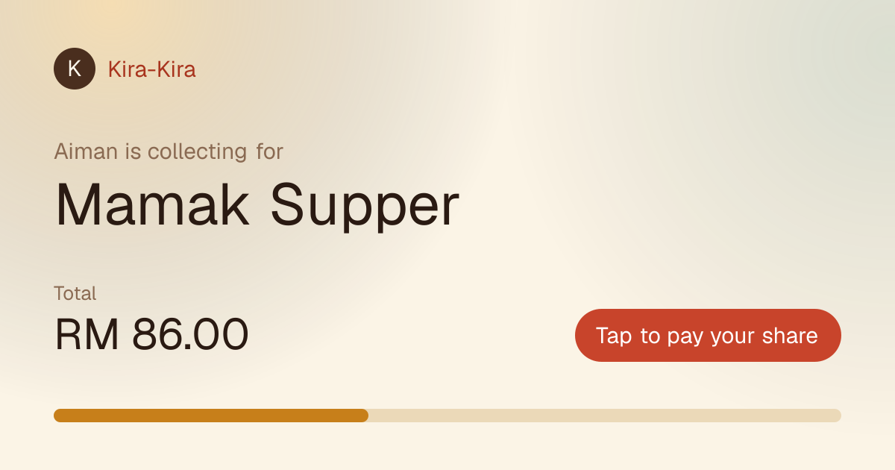
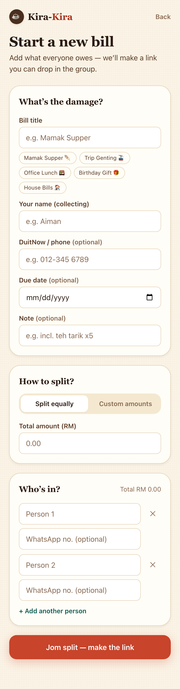
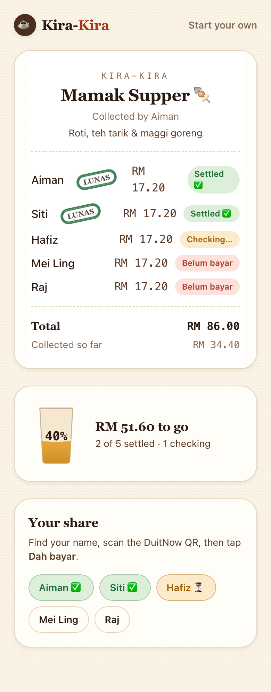
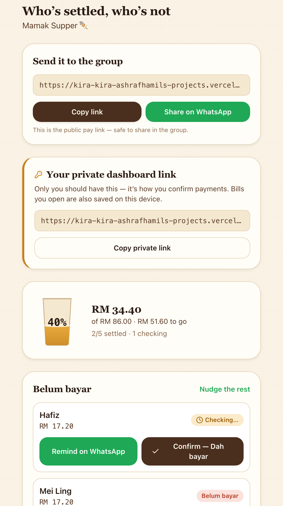

<div align="center">

# ☕ Kira-Kira

### Jom settle, no drama.

**Split the bill, share the link, get paid — without the awkward chasing.**

A kopitiam-warm split-bill & payment tracker for the makan group.
Built for the [KrackedDevs](https://krackeddevs.com) *Split Bill & Payment Tracker* bounty.

[**Live demo →**](https://kira-kira-ashrafhamils-projects.vercel.app) · [Try a sample bill](https://kira-kira-ashrafhamils-projects.vercel.app/b/mamak-supper-demo)



</div>

---

## The problem

Someone always fronts the bill — for the mamak supper, the Genting trip, the office lunch — and then spends a week awkwardly chasing everyone. Kira-Kira makes the chasing disappear: the organizer creates a bill, shares **one link** in the WhatsApp group, and watches a dashboard fill up as people settle. **The app does the chasing, so you stay the good guy.**

> Real payment gateway integration is **not** required by the brief — Kira-Kira ships a clean *simulated* DuitNow flow (see [Transparency Note](#-transparency-note)).

---

## ✨ What it does

|  | Feature | |
|---|---|---|
| 🧾 | **Kopitiam thermal-receipt bill** — every bill renders as a warm makan-shop receipt, with a **LUNAS chop stamp** inked over whoever's settled | *differentiator* |
| 💬 | **Stop the chasing** — one tap drafts a warm, Manglish WhatsApp reminder (`wa.me` deep link) for anyone *belum bayar* | *killer* |
| 📲 | **DuitNow-style QR** — every share comes with a scan-to-pay QR card (simulated for the demo, swap-ready for real) | *killer* |
| 🫖 | **Teh-tarik progress glass** — collection progress fills a glass of teh; it turns green and pops confetti at 100% | *differentiator* |
| 🔗 | **WhatsApp-native sharing** — mobile-first, with a custom per-bill **OG preview card** so the link looks premium in the group chat | *polish* |
| 📊 | **Organizer dashboard** — total collected, remaining, who's settled / checking / *belum bayar*, confirm & undo | *core* |

---

## 📸 Screens

| Create a bill | The receipt | The dashboard |
|---|---|---|
|  |  |  |

---

## ✅ How it meets the brief

| # | Brief requirement | Where it lives |
|---|---|---|
| RE-01 | Organizer can create a bill | `/create` → `CreateBillForm` |
| RE-02 | Bill has title, amount, participants, description | create form fields |
| RE-03 | Equal **or** custom split | split toggle; `splitAmounts()` in `src/lib/db.ts` |
| RE-04 | Generates a shareable bill/payment link | `/b/[slug]` (unguessable slug) |
| RE-05 | Members view the bill & confirm payment | `/b/[slug]` → `PayPanel` ("Dah bayar ✅") |
| RE-06 | Organizer tracks paid / unpaid | `/manage/[token]` → `Dashboard` |
| RE-07 | Dashboard: total collected, remaining, progress | teh-tarik glass + totals |
| RE-08 | Mobile-friendly (opened from WhatsApp) | mobile-first layouts throughout |
| RE-09 | Simulated/manual payment accepted | DuitNow QR card + optional screenshot proof |
| RE-10 | Shareable, premium link preview | dynamic OG image at `/b/[slug]/opengraph-image` |

**Beyond the brief:** WhatsApp auto-reminder templates, LUNAS chop stamp, teh-tarik progress, confetti, payment-screenshot proof upload, bilingual EN/Manglish copy, dark mode.

---

## 🔍 Transparency Note

Honesty over smoke-and-mirrors — what's real vs simulated:

| Capability | Status |
|---|---|
| Bill creation, sharing, tracking, dashboard | ✅ Fully real (persisted in Supabase) |
| Payment confirmation & organizer review | ✅ Fully real |
| WhatsApp reminders | ✅ Real `wa.me` deep links with prefilled text |
| Payment-proof screenshot upload | ✅ Real (Supabase Storage) |
| **DuitNow QR / money movement** | ⚠️ **Simulated** — the QR encodes a demo payload; no funds actually move. Built to swap in a real DuitNow merchant payload. |

---

## 🛠️ Tech & architecture

- **Next.js 16** (App Router, Server Actions) · **TypeScript** · **Tailwind CSS v4** · CSS/SVG motion
- **Supabase** (Postgres + Storage) · deployed on **Vercel**
- **No end-user accounts.** The organizer gets a secret `manage_token` link for the dashboard; the public link is view-and-pay only. This keeps friction at zero (the brief's "simple enough for real people").
- **Security model:** all DB access runs through Server Actions using the Supabase **service-role key (server-only)**. Row-Level Security is enabled with **no public policies**, so the anon key can't read or write anything directly. Organizer mutations are gated on the `manage_token`.

```
src/
  app/
    page.tsx                 landing
    create/                  create-bill flow
    b/[slug]/                public bill receipt + pay + OG image
    manage/[token]/          organizer dashboard
    actions.ts               server actions (create, claim, confirm, upload)
  lib/                       db (service role), types, money/format, copy deck
  components/                TehGlass, Stamp, QrCard, StatusBadge, Confetti, …
```

---

## 🚀 Run locally

```bash
npm install
cp .env.example .env.local   # add your Supabase URL + keys
npm run dev
```

Apply the schema (`supabase/migrations/`) to your Supabase project, then seed a demo bill:

```bash
node scripts/seed-demo.mjs   # creates /b/mamak-supper-demo
```

---

<div align="center">

Made with kopi and care for the KrackedDevs community.
**Jom settle, no drama.** ☕

</div>
